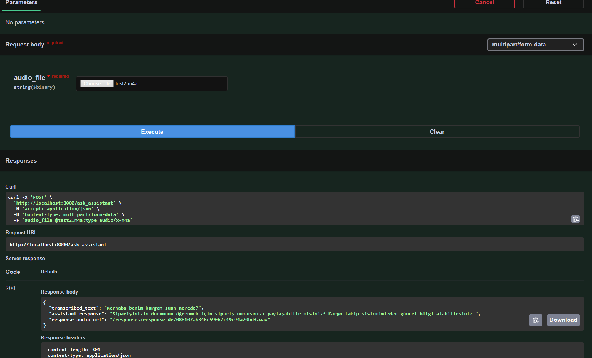
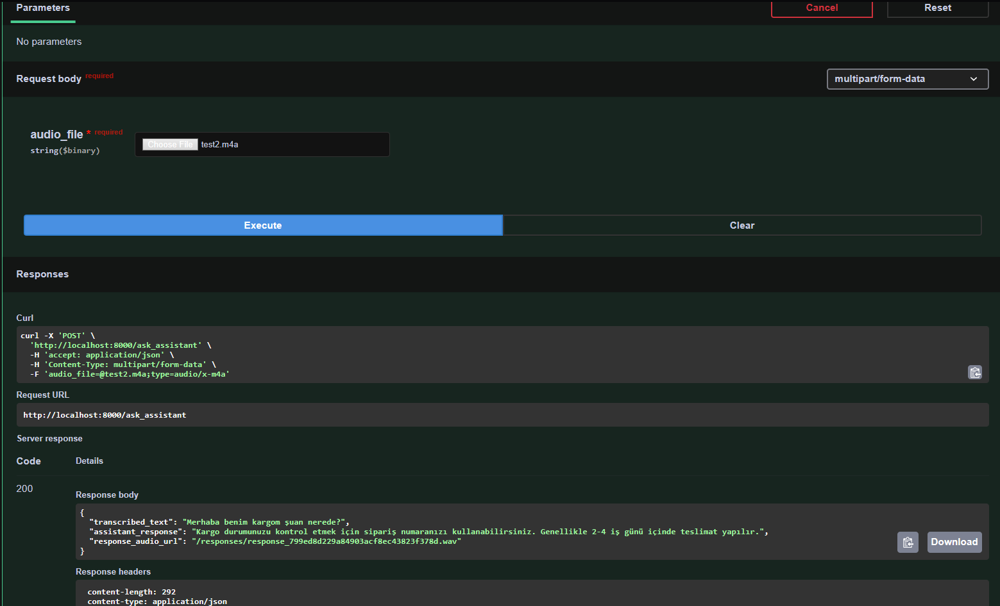

# Voice Assistant API

Python REST API that converts voice queries to text, generates responses using LLMs, and optionally synthesizes speech.

## Screenshots





## Requirements

- Python 3.10+
- ffmpeg in PATH

## Setup

```bash
python -m venv .venv
.venv\Scripts\activate  # Windows
pip install -r requirements.txt
```

## Run

```bash
uvicorn app.main:app --host 0.0.0.0 --port 8000 --reload
```

API docs: http://localhost:8000/docs

## API

### POST /ask_assistant

Process voice input and generate response.

**Input:** `multipart/form-data` with `audio_file` (.wav, .mp3, etc.)

**Output:**
```json
{
  "transcribed_text": "When will my order arrive?",
  "assistant_response": "Your order has been shipped and is expected to be delivered within 2 business days.",
  "response_audio_url": "/responses/response_12345.wav"
}
```

## Environment Variables

| Variable | Default | Description |
|----------|---------|-------------|
| `WHISPER_MODEL` | `base` | Whisper model size |
| `LLM_MODEL` | `mistralai/Mistral-7B-Instruct-v0.3` | LLM model |
| `ENABLE_TTS` | `0` | Enable speech synthesis (0/1) |
| `TTS_ENGINE` | `pyttsx3` | TTS engine (pyttsx3, coqui) |

## Features

- Speech-to-text using OpenAI Whisper
- Response generation using open-source LLMs (Mistral, LLaMA)
- Optional text-to-speech synthesis
- E-commerce customer service responses
- Turkish and English support
